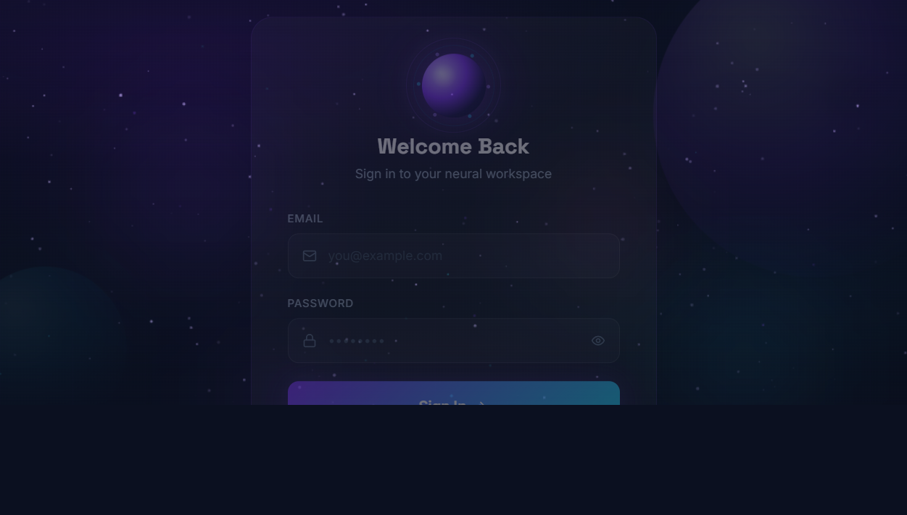
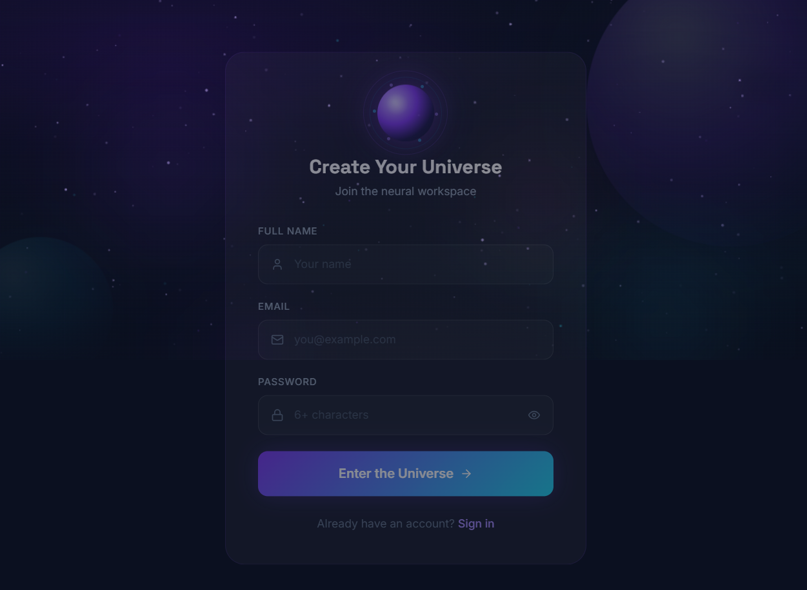

# Peblo Neural Workspace

AI-powered note-taking platform with intelligent summaries, action items,
voice interaction, analytics, public sharing, and MongoDB persistence.

## Live Demo

- Frontend: Coming Soon
- Backend: Coming Soon

## Portfolio Preview

These are the uploaded preview assets for the project portfolio and documentation.

### Login View

### Sign Up View

Peblo Neural Workspace is a production-ready AI-powered note management platform designed to help users capture, organize, analyze, and share knowledge using intelligent AI assistance.

Built for the Peblo Full Stack Developer Challenge.

## Architecture

### Frontend
- React
- Vite
- Tailwind CSS
- Framer Motion
- Zustand

### Backend
- Node.js
- Express

### Database
- MongoDB Atlas
- Mongoose

### AI
- OpenAI / Groq

### Authentication
- JWT
- bcrypt

## Features

- [x] JWT Authentication
- [x] Auto Save Notes
- [x] AI Summaries
- [x] AI Action Items
- [x] AI Tag Generation
- [x] AI Title Suggestions
- [x] Voice Notes
- [x] Public Sharing
- [x] Analytics Dashboard
- [x] MongoDB Persistence
- [x] Responsive Design

## Tech Stack

### Frontend
- React
- Vite
- Tailwind CSS
- Framer Motion
- Zustand

### Backend
- Node.js
- Express
- JWT

### Database
- MongoDB Atlas
- Mongoose

### AI
- OpenAI / Groq

## Tech Stack

### Frontend
- React
- Vite
- Tailwind CSS
- Framer Motion
- Zustand

### Backend
- Node.js
- Express
- JWT

### Database
- MongoDB Atlas
- Mongoose

### AI
- OpenAI / Groq

## Getting Started

1. Install dependencies for both apps:
   - Backend: cd server && npm install
   - Frontend: cd client && npm install
2. Create a local environment file in the server folder using the template in server/.env.example.
3. Start the backend and frontend in separate terminals.

## Environment Variables

Create server/.env from the example below:

PORT=5000
MONGODB_URI=your_mongodb_connection_string
JWT_SECRET=your_jwt_secret
OPENAI_API_KEY=your_api_key
CLIENT_URL=http://localhost:5173
USE_IN_MEMORY_DB=0

## Project Structure

- server/ — Express API, auth, notes, AI integration
- client/ — React/Vite frontend
- docs/ — screenshots and preview assets

## Preview

Screenshots will be added in the docs folder for the workspace, dashboard, AI summary, and login views.

Built for the Peblo Full Stack Developer Challenge.
